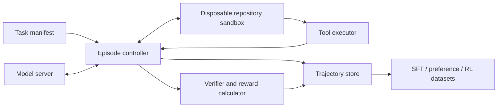

# Agentic coding harness

## Purpose

The harness is both the model's working environment and part of the training
distribution. A change to tool descriptions, timeouts, test commands or
context compaction can change task success even when model weights are
identical. Version the harness and record that version in every trajectory.

The first implementation should be small and deterministic. NeMo Gym can be
integrated once the core task and trace contracts are stable.

## Build versus adopt

Do not build the task runner, environment registry and verifier system from
scratch. The project decision is:

- adopt [Harbor](https://github.com/harbor-framework/harbor) for task,
  environment, verifier and trial orchestration;
- use the official [SWE-bench harness](https://github.com/SWE-bench/SWE-bench)
  only when producing official SWE-bench results;
- keep mini-SWE-agent as a simple bash-only control; and
- defer NeMo Gym integration until online RL.

The project-owned component is a thin Harbor agent/model adapter that renders
Qwen's native chat template, exposes the target six-tool surface, accounts for
budgets and exports the trajectory record below. This interface is part of the
training distribution and cannot be delegated to a bash-only agent without
changing the research question.

See [Minimum path](minimum-path.md) for the exact Experiment 1 cut.

## Architecture



Keep model generation on the GPU and test execution on CPU workers. A worker
must never be able to reach another task's checkout, training secrets or the
host filesystem.

## Initial tool surface

Prefer a narrow semantic interface over unrestricted shell access.

| Tool | Responsibility | Required controls |
| --- | --- | --- |
| `list_files` | Enumerate repository paths | Rooted path; result cap; ignore VCS internals by default |
| `read_file` | Read a file or line window | Rooted path; byte/line cap; binary rejection |
| `search` | Search text using `rg` semantics | Match and output limits; no path escape |
| `apply_patch` | Apply an explicit unified patch | Reject paths outside repository; retain patch result |
| `run_tests` | Run allow-listed test profiles | CPU, memory, process and wall-time limits |
| `shell` | Exceptional commands not covered above | Disabled initially or strict allow-list; no network by default |

Tool outputs should be concise but faithful. Truncation must be explicit and
include enough metadata for the model to request a narrower view.

Do not train one tool schema and deploy another. Names, JSON schema,
descriptions and error shapes are model inputs and need semantic versioning.

## Episode lifecycle

1. Resolve an immutable task manifest and repository revision.
2. Create a disposable checkout with network disabled.
3. Run setup and baseline tests; reject broken tasks unless failure is the
   intended starting state.
4. Render developer/user messages and tools through the native Qwen template.
5. Generate one assistant action.
6. Parse and validate the action before execution.
7. Execute the tool under resource limits and append a structured tool result.
8. Continue until the model completes, a budget is exhausted or a terminal
   fault occurs.
9. Run visible and hidden verification from a clean state.
10. Persist the full trace, patch, metrics and reward components.
11. Destroy the sandbox.

An episode must have explicit budgets for model tokens, tool calls, elapsed
time, subprocesses, disk use and patch size. Budget exhaustion is a first-class
termination reason, not a generic exception.

## Task manifest

```json
{
  "task_id": "internal/python/example-0042",
  "repo": "ssh-or-local-identifier",
  "revision": "immutable-commit-sha",
  "harness_version": "0.1.0",
  "language": "python",
  "request": "Fix the cache invalidation bug and add a regression test.",
  "setup_profile": "python-uv",
  "visible_test_profile": "unit",
  "hidden_test_profile": "grading",
  "budgets": {
    "tool_calls": 12,
    "generated_tokens": 12000,
    "wall_seconds": 900,
    "patch_lines": 300
  },
  "split": "train"
}
```

Never store secrets, mutable branch names or hidden-test source in a model
prompt.

## Trajectory record

Store one immutable record per attempt. JSONL or Parquet are both suitable as
long as nested messages are preserved.

```json
{
  "trajectory_id": "uuid",
  "task_id": "internal/python/example-0042",
  "model_revision": "hub-revision-or-checkpoint-id",
  "adapter_revision": "optional-adapter-revision",
  "harness_version": "0.1.0",
  "generation": {
    "reasoning_effort": "medium",
    "temperature": 1.0,
    "seed": 3407
  },
  "tools": [{"name": "read_file", "schema_version": "1.0"}],
  "messages": [
    {"role": "developer", "content": "..."},
    {"role": "user", "content": "..."},
    {"role": "assistant", "tool_calls": [{"name": "read_file", "arguments": {"path": "src/cache.py"}}]},
    {"role": "tool", "name": "read_file", "content": "..."}
  ],
  "termination": "assistant_complete",
  "patch": "diff --git ...",
  "verification": {
    "baseline_passed": true,
    "visible_passed": 18,
    "visible_total": 18,
    "hidden_passed": 6,
    "hidden_total": 6
  },
  "reward": {
    "total": 1.0,
    "tests": 1.0,
    "protocol": 0.0,
    "efficiency": 0.0
  },
  "usage": {
    "prompt_tokens": 24000,
    "completion_tokens": 5300,
    "tool_calls": 9,
    "wall_seconds": 212
  }
}
```

The production schema should store tool-call IDs and raw parser output as well
as the normalized form. That allows protocol bugs to be distinguished from
model reasoning failures.

## Chat-template invariants

Add tests that prove:

- developer, user, assistant and tool roles survive render/tokenize/decode;
- nested JSON arguments parse correctly;
- multiple tool calls retain order and IDs;
- assistant-only loss includes assistant tool calls and final answers but masks
  developer, user and tool observations;
- thinking blocks follow the chosen preservation policy; and
- truncation never creates a partial JSON tool call.

The raw chain of thought should not be exposed in product logs. Training traces
may contain model-generated reasoning where permitted, but access and retention
must be deliberate. Store operational actions and outcomes independently so
the dataset remains useful if reasoning fields later need to be removed.

## Sandbox requirements

- Disposable container, VM or equivalent filesystem isolation per episode.
- Non-root execution.
- Network disabled unless a task explicitly requires an allow-listed endpoint.
- Read-only base image and isolated writable repository volume.
- No host Docker socket, cloud metadata or training credentials.
- Process, file descriptor, CPU, memory, disk and time limits.
- Output and log byte limits.
- Explicit cleanup after success, error and timeout.

Treat repository code as untrusted. Running tests is code execution.

Hosted Colab should not be treated as this sandbox. Use a Harbor isolated
backend for untrusted tasks. A temporary-directory `trusted-dev` backend is
acceptable only for the reviewed 12-task pilot; it must be labelled insecure
and must not receive arbitrary public repositories or training credentials.

## Collection modes

Use the same controller in four modes:

1. **Baseline:** frozen upstream model; multiple seeds where sampling is used.
2. **Demonstration:** trusted model or reviewed human trajectory used for SFT.
3. **Candidate generation:** several attempts retained for preference pairs.
4. **Online RL:** current policy samples actions and receives immediate
   environment feedback.

The fourth mode should not be implemented first. The first three establish the
task validity, trace schema and reward tests needed to make RL trustworthy.

## Failure taxonomy

Record at least these mutually distinguishable outcomes:

- invalid tool JSON;
- unknown tool or schema version;
- tool execution failure;
- repeated non-progressing action;
- context or output truncation;
- timeout or other budget exhaustion;
- patch failed to apply;
- build or lint failure;
- visible-test regression;
- hidden-test failure;
- correct implementation;
- harness/infrastructure failure.

Infrastructure failures must not become negative model rewards or rejected
preference examples.
